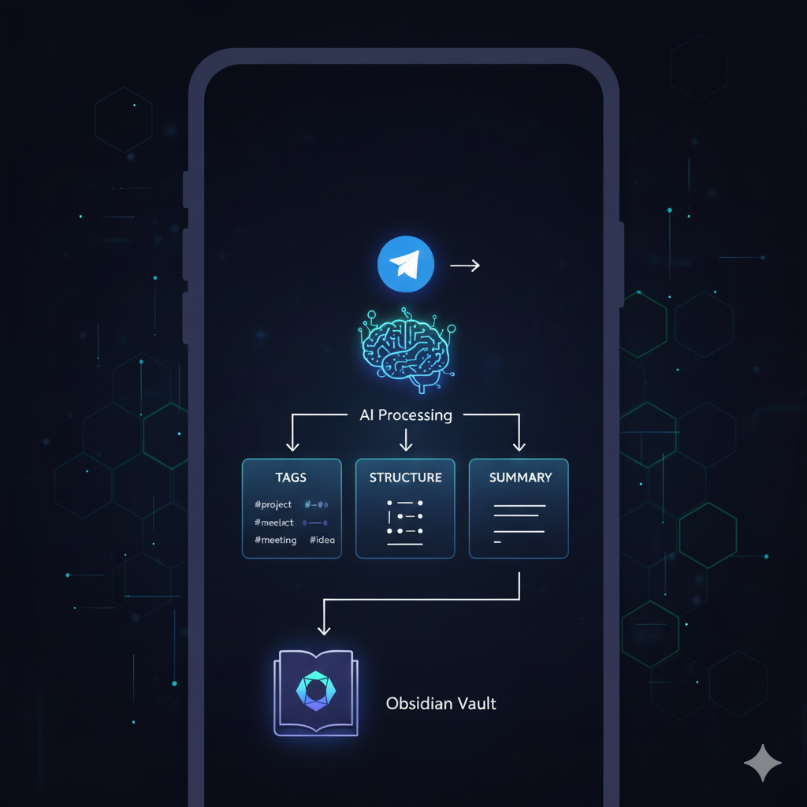

<p align="center">
    
</p>

# Obsidian Telegram Bot

An intelligent Telegram bot that automatically saves messages to your Obsidian vault with AI-powered organization, tagging, and connection detection. Perfect for INTPs who collect lots of information but need help with structure and organization.

## Features

- **Smart AI Organization**: Automatically analyzes content and suggests tags, folders, and connections
- **Multi-Provider AI**: Use Claude API or local LLMs (Ollama)
- **Image OCR**: Extract text from images using Tesseract
- **Article Summarization**: Fetch and summarize web articles
- **Auto-Save Workflow**: Save everything immediately, organize later
- **Rich Metadata**: YAML frontmatter with timestamps, sources, and AI suggestions
- **Connection Detection**: Find related notes in your vault
- **Telegram Preview**: Get instant feedback on saved notes

## Prerequisites

- Python 3.9+
- Obsidian vault (local folder)
- Telegram bot token (from [@BotFather](https://t.me/botfather))
- AI Provider (one of):
  - Anthropic Claude API key, OR
  - Ollama installed locally

### System Dependencies

**macOS:**
```bash
brew install tesseract
```

**Ubuntu/Debian:**
```bash
sudo apt-get update
sudo apt-get install tesseract-ocr
```

**Optional: Ollama (for local LLM)**
```bash
# macOS/Linux
curl -fsSL https://ollama.com/install.sh | sh

# Pull a model
ollama pull llama3.1:8b
```

## Quick Start

### 1. Clone and Install

```bash
cd /path/to/obsidian-telegram
pip install -r requirements.txt
```

### 2. Create Telegram Bot

1. Message [@BotFather](https://t.me/botfather) on Telegram
2. Send `/newbot` and follow the prompts
3. Save your bot token

### 3. Get Your Telegram User ID

1. Message [@userinfobot](https://t.me/userinfobot) on Telegram
2. Note your user ID

### 4. Configure Environment

Create `.env` file (copy from `.env.example`):

```bash
cp .env.example .env
```

Edit `.env`:

```env
# Telegram Bot Token (from @BotFather)
TELEGRAM_BOT_TOKEN=your_bot_token_here

# Your Telegram User ID (from @userinfobot)
TELEGRAM_ALLOWED_USERS=123456789

# Your Obsidian Vault Path
OBSIDIAN_VAULT_PATH=/Users/yourname/Documents/ObsidianVault
OBSIDIAN_INCOMING_FOLDER=Incoming

# Claude API Key (if using Claude)
CLAUDE_API_KEY=sk-ant-your-key-here

# Logging
LOG_LEVEL=INFO
```

### 5. Configure AI Provider

Edit `config.yaml` to choose your AI provider:

**Option A: Use Claude (recommended)**
```yaml
ai:
  provider: claude
  claude:
    model: claude-3-5-sonnet-20241022
```

**Option B: Use Ollama (local, private)**
```yaml
ai:
  provider: ollama
  ollama:
    model: llama3.1:8b
```

### 6. Run the Bot

```bash
python main.py
```

You should see:
```
Loading configuration...
Obsidian Telegram Bot Starting
AI Provider: claude
Obsidian Vault: /Users/yourname/Documents/ObsidianVault
Bot is ready to receive messages!
```

### 7. Test It

1. Open Telegram and find your bot
2. Send `/start` to begin
3. Send any message - text, image, or link!

## Configuration

### config.yaml

Customize bot behavior:

```yaml
ai:
  provider: claude  # or "ollama"
  analysis:
    max_tags: 5
    generate_summary: true
    suggest_connections: true

obsidian:
  incoming_folder: Incoming
  filename_strategy: hybrid  # "timestamp", "ai_title", or "hybrid"
  frontmatter:
    tag_format: yaml  # or "inline" for #hashtags

media:
  ocr:
    enabled: true
    language: eng
  article_summary:
    enabled: true
    max_length: 500

bot:
  send_preview: true
  fallback_on_ai_error: true
```

## Usage Examples

### Saving Text

Send any text message:
```
Just read an interesting article about knowledge graphs...
```

Bot responds:
```
✓ Saved to Obsidian

Title: Thoughts on Knowledge Graphs
Folder: Ideas
Tags: #knowledge-management, #technology, #learning

Summary: Interest in knowledge graphs as a way to organize information...
Related to: Building a Second Brain
```

### Saving Articles

Send a URL:
```
https://example.com/article-about-ai
```

Bot fetches the article, extracts content, and saves with summary.

### Saving Images

Send an image (with optional caption). Bot will:
1. Extract text via OCR
2. Analyze content
3. Save image to `_attachments/`
4. Create note with embedded image

### Note Format

Notes are saved in Markdown with YAML frontmatter:

```markdown
---
created: 2025-12-25T20:50:00
source: telegram
tags:
  - technology
  - ai
  - ideas
suggested_folder: Knowledge/Tech
ai_provider: claude
---

# Understanding INTP Cognitive Functions

[Your message content here...]

---

## AI Analysis

**Summary**: This content explores INTP cognitive functions...

**Suggested Connections**:
- Related to "Information Processing Strategies"
- Connects with "Building a Second Brain"

---

**Source**: Telegram (text)
**Received**: 2025-12-25 20:50:00
```

## Project Structure

```
obsidian-telegram/
├── main.py                 # Entry point
├── config.yaml             # Bot configuration
├── .env                    # Secrets (not in git)
├── requirements.txt        # Dependencies
├── src/
│   ├── ai/                 # AI providers (Claude, Ollama)
│   ├── bot/                # Telegram bot handlers
│   ├── processors/         # Content, media, article processors
│   ├── obsidian/           # Vault management, note creation
│   └── utils/              # Config, logging
└── logs/                   # Log files
```

## Troubleshooting

### Bot doesn't respond

1. Check user ID in `.env` matches your Telegram user ID
2. Verify bot token is correct
3. Check logs in `logs/bot.log`

### OCR not working

1. Install Tesseract: `brew install tesseract` (macOS)
2. Check `config.yaml` has `ocr.enabled: true`

### AI analysis fails

1. **Claude**: Verify API key in `.env`
2. **Ollama**: Ensure Ollama is running (`ollama serve`)
3. Check model is pulled (`ollama list`)
4. Enable fallback: `bot.fallback_on_ai_error: true`

### Vault path errors

1. Ensure path exists: `ls /path/to/vault`
2. Use absolute path, not relative
3. Create Incoming folder manually if needed

## Advanced Configuration

### Multiple Users

```env
TELEGRAM_ALLOWED_USERS=123456789,987654321,111222333
```

### Custom Note Template

Edit `obsidian.template_style` in `config.yaml` or modify `src/obsidian/note_creator.py`

### Voice Transcription

Voice transcription is a placeholder. To implement:

1. Add Whisper API integration in `src/processors/media_processor.py`
2. Or use OpenAI's Whisper API
3. Update `process_voice()` method

## Development

### Running in Development

```bash
# Create virtual environment
python -m venv venv
source venv/bin/activate  # or `venv\Scripts\activate` on Windows

# Install dependencies
pip install -r requirements.txt

# Run with debug logging
LOG_LEVEL=DEBUG python main.py
```

### Adding Custom Processors

See `src/processors/` for examples. Extend the processor classes and register in `main.py`.

## Privacy & Security

- **Local First**: Bot runs on your machine, talks directly to your vault
- **API Keys**: Stored in `.env` (gitignored)
- **User Access**: Restrict via `TELEGRAM_ALLOWED_USERS`
- **Ollama Option**: Use local LLMs for complete privacy

## Contributing

Issues and pull requests welcome! This is designed to be extensible.

## License

MIT License - feel free to modify and extend!

## Credits

Built for INTPs who love collecting information but need help organizing it into a useful second brain.

Powered by:
- [python-telegram-bot](https://github.com/python-telegram-bot/python-telegram-bot)
- [Anthropic Claude API](https://www.anthropic.com/)
- [Ollama](https://ollama.com/)
- [Tesseract OCR](https://github.com/tesseract-ocr/tesseract)
- [Obsidian](https://obsidian.md/)
